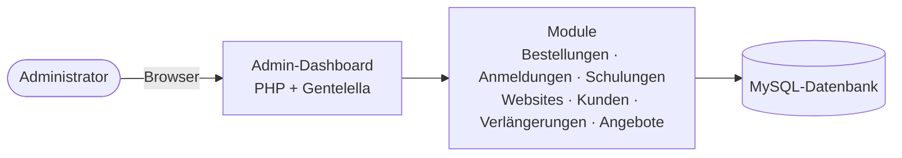
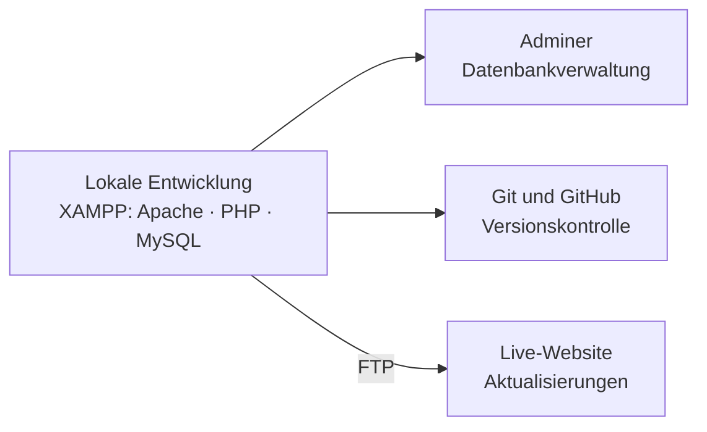

# Giga Manager — Admin Dashboard

**Eine Back-Office-Anwendung zur Verwaltung von Website, Bestellungen, Anmeldungen, Schulungen und Kunden eines Webhosting-Unternehmens — entwickelt während eines Praktikums.**

[**🖼️ Screenshots**](#screenshots) · [**✨ Funktionen**](#funktionen) · [**🌐 Firmenwebsite**](https://www.gigamanager.com/v1/)

[🇬🇧 English](README.md) · [🇩🇪 Deutsch](README.de.md)

> [!NOTE]
> **Der Quellcode ist nicht öffentlich.** Diese Anwendung wurde für ein Unternehmen entwickelt, und der Code bleibt dessen Eigentum. Dieses Repository dokumentiert die Arbeit durch eine Beschreibung und Screenshots. Auf Anfrage ist eine Live-Vorführung des Codes möglich — siehe [Mehr erfahren](#mehr-erfahren).

<!-- TODO: Sobald eine 60-90 Sekunden lange Bildschirmaufnahme des Dashboards vorliegt (lokale Umgebung, Testdaten),
     das GIF als docs/demo.gif speichern und den folgenden Block auskommentieren.

  

-->

---

## Inhaltsverzeichnis

- [Überblick](#überblick)
- [Was dieses Projekt zeigt](#was-dieses-projekt-zeigt)
- [Funktionen](#funktionen)
- [Screenshots](#screenshots)
- [Technologie-Stack](#technologie-stack)
- [Architektur und Arbeitsablauf](#architektur-und-arbeitsablauf)
- [Datenschutz und Vertraulichkeit](#datenschutz-und-vertraulichkeit)
- [Technische Herausforderungen und Erkenntnisse](#technische-herausforderungen-und-erkenntnisse)
- [Mögliche Verbesserungen](#mögliche-verbesserungen)
- [Mehr erfahren](#mehr-erfahren)
- [Autor](#autor)
- [Lizenz](#lizenz)

---

## Überblick

Dieses Projekt wurde während meines Praktikums bei **Giga Manager** (Béni Mellal, Marokko) entwickelt, einem Unternehmen, das Webhosting und Webentwicklung anbietet. Das Unternehmen verkauft außerdem Geschäftsanwendungen (zum Beispiel für die Verwaltung von Schulen, Apotheken und Optikern), Website-Vorlagen und Schulungen.

Ich habe ein **Administrations-Dashboard** entwickelt, mit dem das Team all dies über eine einzige Oberfläche verwalten kann: eingehende Bestellungen, Benutzeranmeldungen, Schulungsprogramme, Anfragen zu Website-Vorlagen, Angebote und Kunden. Es umfasst außerdem Inhaltsaktualisierungen auf mehreren Seiten der offiziellen Firmenwebsite, und ich habe im Rahmen der Arbeit einige Seiten der Live-Website direkt angepasst.

| | |
|---|---|
| **Kontext** | Praktikumsprojekt |
| **Unternehmen** | Giga Manager, Béni Mellal, Marokko |
| **Zeitraum** | TODO |
| **Meine Rolle** | TODO (z. B. Full-Stack-Entwickler) |
| **Team** | TODO (z. B. alleiniger Entwickler des Dashboards) |
| **Quellcode** | Privat — Eigentum des Unternehmens |

---

## Was dieses Projekt zeigt

- **Umsetzung für ein echtes Unternehmen**, keine Tutorial-Übung: echte Geschäftsmodule, echte Abläufe
- **Back-Office-Entwicklung** in PHP und MySQL über viele zusammenhängende Entitäten hinweg
- **Alltägliche Admin-UX**: Suche, Filter, Datumsbereiche, Statusanzeigen, Zähler, Karten- und Tabellenansichten
- **Aufbau auf einer bestehenden Vorlage** (Gentelella / Bootstrap) und deren Weiterentwicklung zu einer stimmigen Anwendung
- **Arbeit an einer Live-Website** mit lokaler Entwicklungsumgebung und Deployment per FTP
- **Professionelle Diskretion**: das Projekt öffentlich zeigen, ohne Quellcode, Kundendaten oder Zugangsdaten preiszugeben

---

## Funktionen

Die Oberfläche ist auf Französisch, der Arbeitssprache der Kunden des Unternehmens. Die wichtigsten Module sind:

| Modul | Was es tut |
|---|---|
| **Dashboard** | Kennzahlen-Karten (Bestellungen, Administratoren, Schulungen, Anmeldungen, Klassen, Umsatz) mit Trendanzeigen, eine Datenbankübersicht mit Zählern und Gesamtleistungsbalken |
| **Bestellungen** | Vollständige Bestellliste mit Zählern pro Kategorie (Webanwendungen, Hosting, digitales Marketing), Suche nach Name, E-Mail oder ID und Statusfilter |
| **Anmeldungen und Anfragen** | Verwaltung von Anmeldungen, Praktikumsbewerbungen, Kontaktnachrichten und Angebotsanfragen, mit Suche, Kategorie- und Datumsfiltern sowie den Aktionen Ansehen / E-Mail / Löschen |
| **E-Mail-Verlauf** | Verlauf der E-Mails, die aus dem Modul für Angebotsanfragen versendet wurden |
| **Schulungen** | Kurskatalog als Karten mit Status, Klickzähler, Gruppenverwaltung, Preisen, den Aktionen Pausieren / Bearbeiten / Löschen und einer Liste der Kundenbewertungen |
| **Websites und Vorlagen** | Katalog von Website-Vorlagen und eine Anfrage-Pipeline mit Status wie *Preisentscheidung* und *Zahlungsprüfung* |
| **Pakete und Preise** | Verwaltung der Angebote und Preispläne des Unternehmens |
| **Kunden** | Kundenkarten mit Logo, Stadt, Branche und Status; Hinzufügen, Pausieren, Bearbeiten und Löschen |
| **Verlängerungen** | Abonnementübersicht, die zeigt, ob jede Bestellung aktiv oder inaktiv ist, mit einer Aktion zum Verlängern |
| **Administratorprofil** | Persönliche Daten, Rolle, Status und Avatar bearbeiten; Anzeige der letzten Anmeldung |

---

## Screenshots

Alle Screenshots stammen aus einer lokalen Entwicklungsumgebung.

<table>
  <tr>
    <td width="33%"> <b>Dashboard</b> — Kennzahlen, Datenbankübersicht, Gesamtleistung</td>
    <td width="33%"> <b>Bestellungen</b> — Kategorien, Suche und Statusfilter</td>
    <td width="33%"> <b>Praktikumsanfragen</b> — Suche, Kategorie- und Datumsfilter</td>
  </tr>
  <tr>
    <td width="33%"> <b>Vorlagenanfragen</b> — Preisentscheidung und Zahlungsprüfung</td>
    <td width="33%"> <b>Verlängerungen</b> — aktive / inaktive Abonnements</td>
    <td width="33%"> <b>Angebotsanfragen</b> — Filter und E-Mail-Verlauf</td>
  </tr>
  <tr>
    <td width="33%"> <b>Administratorprofil</b> — Konto und Rolle</td>
    <td width="33%"> <b>Kunden</b> — Kartenansicht mit Status und Aktionen</td>
    <td width="33%"> <b>Schulungen</b> — Katalog, Gruppen und Preise</td>
  </tr>
</table>

---

## Technologie-Stack

| Schicht | Technologie | Rolle im Projekt |
|---|---|---|
| Back-End | PHP | Serverlogik und Seiten |
| Datenbank | MySQL | Relationale Speicherung von Bestellungen, Benutzern, Kursen, Kunden und mehr |
| Admin-Oberfläche | Gentelella (HTML, CSS, JavaScript, Bootstrap) | Als Dashboard angepasste Vorlage |
| Lokale Umgebung | XAMPP | Apache, PHP und MySQL auf dem Entwicklungsrechner |
| Datenbank-Werkzeug | Adminer | Datenbankverwaltung während der Entwicklung |
| Deployment | FTP | Veröffentlichung von Aktualisierungen auf der Live-Website |
| Versionsverwaltung | Git und GitHub | Versionskontrolle |

---

## Architektur und Arbeitsablauf

### Anwendungsstruktur

### Entwicklungs- und Deployment-Ablauf

---

## Datenschutz und Vertraulichkeit

Da der Code dem Unternehmen gehört, enthält dieses Repository keinen Quellcode, kein Datenbankschema, keine Zugangsdaten und keine Konfigurationsdateien.

<!-- TODO: Die beiden folgenden Sätze NUR beibehalten, nachdem 07-admin-profile.png neu maskiert wurde
     (Login-E-Mail in der Tabelle sichtbar) und die Kundenlogos in 08-clients.png unkenntlich gemacht wurden. -->
Die Screenshots wurden in einer lokalen Entwicklungsumgebung aufgenommen, und personenbezogene Daten wie E-Mail-Adressen, Telefonnummern und Umsatzzahlen wurden maskiert.

---

## Technische Herausforderungen und Erkenntnisse

<!-- TODO: Jeden Punkt mit der eigenen Erfahrung abgleichen und die Formulierung anpassen. -->

- **Ein umfangreiches Back-Office organisieren.** Das Dashboard deckt viele zusammenhängende Entitäten ab: Bestellungen, Anmeldungen, Kurse und Gruppen, Vorlagen, Kunden, Verlängerungen und Angebote. Die Daten in einem relationalen MySQL-Schema zu organisieren und die Navigation über alle Module hinweg einheitlich zu halten, war die zentrale strukturelle Herausforderung.

- **Eine bestehende Vorlage anpassen.** Gentelella liefert das Layout, aber es in eine stimmige französischsprachige Anwendung zu verwandeln — Filter, Statusanzeigen, Zähler, Kartenansichten — bedeutete, fremdes HTML, CSS und JavaScript zu lesen und umzugestalten, statt alles von Grund auf neu zu schreiben.

- **An einer Live-Website arbeiten.** Da ich auch Seiten der Live-Website des Unternehmens bearbeitet habe, mussten Änderungen sorgfältig in einer lokalen XAMPP-Umgebung vorbereitet und anschließend per FTP veröffentlicht werden.

- **Arbeit unter Vertraulichkeit teilen.** Das Projekt öffentlich zu dokumentieren, ohne Code, Kundendaten oder Zugangsdaten preiszugeben, erforderte die Entscheidung, was gezeigt werden darf, und das Maskieren des Restes.

---

## Mögliche Verbesserungen

Wenn ich das Projekt heute neu aufbauen würde, würde ich Folgendes in Betracht ziehen:

- Die Struktur mit einem Skript pro Seite (`commandes.php`, `clients_liste.php`) durch Routing und ein MVC-Framework wie Laravel oder Symfony ersetzen
- Automatisierte Tests und eine CI-Pipeline
- Feingranulare Rollen und Berechtigungen über eine einzelne Administratorrolle hinaus
- Ein Audit-Log, das Aktionen der Administratoren aufzeichnet

---

## Mehr erfahren

Der Quellcode ist privat, aber ich zeige ihn gerne und führe die Anwendung in einem Vorstellungsgespräch oder einem Call live vor.

📧 [leilaeltousy@gmail.com](mailto:leilaeltousy@gmail.com)

---

## Autor

**El_Tousy** — Informatikstudent

---

## Lizenz

Dies ist **kein** Open-Source-Projekt. Dieses Repository dient ausschließlich als Portfolio-Überblick. Die Anwendung und ihr Quellcode bleiben Eigentum von Giga Manager, und die Screenshots sowie das Firmen-Branding dürfen nicht ohne Erlaubnis weiterverwendet werden.
