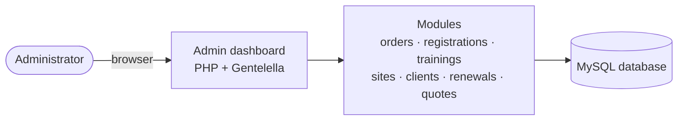
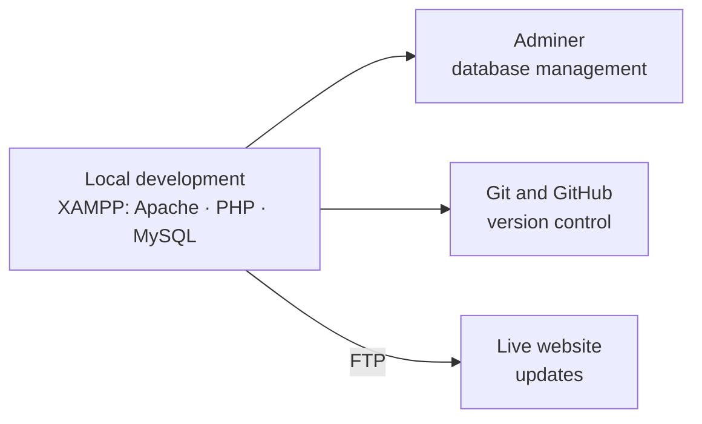

# Giga Manager — Admin Dashboard

**A back-office application for managing a web-hosting company's website, orders, registrations, trainings and clients — built during an internship.**

[**🖼️ Screenshots**](#screenshots) · [**✨ Features**](#features) · [**🌐 Company Website**](https://www.gigamanager.com/v1/)

[🇬🇧 English](README.md) · [🇩🇪 Deutsch](README.de.md)

> [!NOTE]
> **The source code is not public.** This application was built for a company, and the code remains its property. This repository documents the work through a description and screenshots. A live walkthrough of the code is available on request — see [See More](#see-more).

<!-- TODO: once you have a 60-90s screen recording of the dashboard (local environment, test data),
     save the GIF as docs/demo.gif and uncomment the block below.

  

-->

---

## Table of Contents

- [Overview](#overview)
- [What this project demonstrates](#what-this-project-demonstrates)
- [Features](#features)
- [Screenshots](#screenshots)
- [Tech Stack](#tech-stack)
- [Architecture and Workflow](#architecture-and-workflow)
- [Privacy and Confidentiality](#privacy-and-confidentiality)
- [Technical Challenges and Learnings](#technical-challenges-and-learnings)
- [Possible Improvements](#possible-improvements)
- [See More](#see-more)
- [Author](#author)
- [License](#license)

---

## Overview

This project was developed during my internship at **Giga Manager** (Béni Mellal, Morocco), a company providing web hosting and website development services. The company also sells business applications (for example school, pharmacy and optician management), website templates and training courses.

I built an **administration dashboard** that lets the team manage all of this from a single interface: incoming orders, user registrations, training programs, website template requests, quotes and clients. It also covers content updates on several pages of the company's official website, and I directly modified some pages of the live site as part of the work.

| | |
|---|---|
| **Context** | Internship project |
| **Company** | Giga Manager, Morocco |
| **Source code** | Private — property of the company |

---

## What this project demonstrates

- **Delivery for a real company**, not a tutorial exercise: real business modules, real workflows
- **Back-office development** in PHP and MySQL across many related entities
- **Everyday admin UX**: search, filters, date ranges, status badges, counters, card and table views
- **Building on an existing template** (Gentelella / Bootstrap) and turning it into a coherent application
- **Working on a live website**, with a local development environment and deployment by FTP
- **Professional discretion**: sharing the work publicly without exposing source code, client data or credentials

---

## Features

The interface is in French, the working language of the company's customers. The main modules are:

| Module | What it does |
|---|---|
| **Dashboard** | KPI cards (orders, administrators, trainings, registrations, classes, revenue) with trend indicators, a database overview with counters, and global performance bars |
| **Orders** | Full order list with per-category counts (web applications, hosting, digital marketing), search by name, e-mail or ID, and status filtering |
| **Registrations and requests** | Management of registrations, internship applications, contact messages and quote requests, with search, category and date-range filters, and view / e-mail / delete actions |
| **Email history** | History of the e-mails sent from the quote-request module |
| **Trainings** | Course catalogue as cards, with status, click counter, group management, pricing, pause / edit / delete actions, and a customer-reviews list |
| **Sites and templates** | Website template catalogue and a request pipeline with statuses such as *price decision* and *payment validation* |
| **Packs and pricing** | Management of the offers and price plans sold by the company |
| **Clients** | Client cards with logo, city, business sector and status; add, pause, edit and delete |
| **Renewals** | Subscription overview showing whether each order is active or inactive, with a renew action |
| **Administrator profile** | Edit personal information, role, status and avatar; last-login indicator |

---

## Screenshots

All screenshots come from a real development environment.

<table>
  <tr>
    <td width="33%"> <b>Dashboard</b> — KPIs, database overview, global performance</td>
    <td width="33%"> <b>Orders</b> — categories, search and status filter</td>
    <td width="33%"> <b>Internship requests</b> — search, category and date filters</td>
  </tr>
  <tr>
    <td width="33%"> <b>Template requests</b> — price decision and payment validation</td>
    <td width="33%"> <b>Renewals</b> — active / inactive subscriptions</td>
    <td width="33%"> <b>Quote requests</b> — filters and e-mail history</td>
  </tr>
  <tr>
    <td width="33%"> <b>Administrator profile</b> — account and role</td>
    <td width="33%"> <b>Clients</b> — card view with status and actions</td>
    <td width="33%"> <b>Trainings</b> — catalogue, groups and pricing</td>
  </tr>
</table>

---

## Tech Stack

| Layer | Technology | Role in the project |
|---|---|---|
| Back end | PHP | Server-side logic and pages |
| Database | MySQL | Relational storage for orders, users, courses, clients and more |
| Admin interface | Gentelella (HTML, CSS, JavaScript, Bootstrap) | Template adapted into the dashboard |
| Local environment | XAMPP | Apache, PHP and MySQL on the development machine |
| Database tooling | Adminer | Managing the database during development |
| Deployment | FTP | Publishing updates to the live website |
| Versioning | Git and GitHub | Version control |

---

## Architecture and Workflow

### Application structure

### Development and deployment workflow

---

## Privacy and Confidentiality

Because the code belongs to the company, this repository contains no source code, no database schema, no credentials and no configuration files.

<!-- TODO: keep the two sentences below ONLY after re-masking 07-admin-profile.png
     (login e-mail visible in the table) and blurring the client logos in 08-clients.png. -->
The screenshots were taken in a local development environment, and personal data such as e-mail addresses, phone numbers and revenue figures has been masked.

---

## Technical Challenges and Learnings

<!-- TODO: check each point against your real experience and adjust the wording. -->

- **Organising a large back office.** The dashboard covers many related entities: orders, registrations, courses and groups, templates, clients, renewals and quotes. Keeping the data organised in a relational MySQL schema, and the navigation consistent across modules, was the core structural challenge.

- **Adapting an existing template.** Gentelella provides the layout, but turning it into a coherent French-language application — filters, status badges, counters, card views — meant reading and reshaping someone else's HTML, CSS and JavaScript rather than writing everything from scratch.

- **Working on a live website.** Since I also edited pages of the company's live site, changes had to be prepared carefully in a local XAMPP environment and then published by FTP.

- **Sharing work under confidentiality.** Documenting the project publicly without exposing code, client data or credentials required deciding what could be shown, and masking the rest.

---

## Possible Improvements

If I rebuilt this project today, I would explore:

- Replacing the page-per-script structure (`commandes.php`, `clients_liste.php`) with routing and an MVC framework such as Laravel or Symfony
- Automated tests and a CI pipeline
- Granular roles and permissions beyond a single administrator role
- An audit log recording administrator actions

---

## See More

The source code is private, but I'm happy to walk through it and run the application live during an interview or a call.

---

## Author

**El_Tousy** — Computer Science student

---

## License

This is **not** an open-source project. This repository is a portfolio overview only. The application and its source code remain the property of Giga Manager, and the screenshots and company branding may not be reused without permission.
